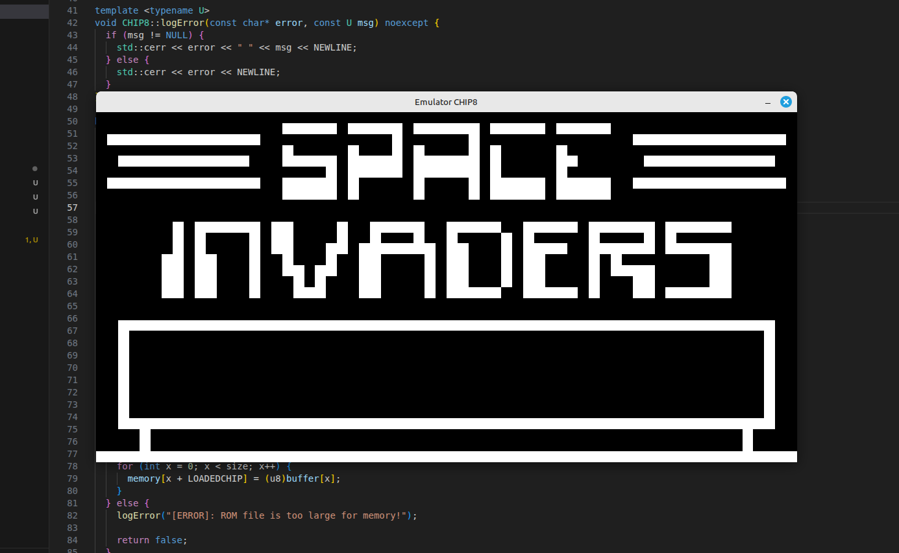

# CHIP-8 Emulator in C++
This is a simple project that aims to emulate the CHIP-8  interpreted programming language. You can use it to run simple .ch8 games and programs. The whole emulator is written in C++, and it uses SDL2 to manage the window. The scope of this emulator is to develop my skills in low-level and hardware level programming. 

### Usage

The project uses CMake as build system, you can clone the git repository and build it using:

``` bash 
    cd chip8
    mkdir build && cd build
    cmake .. && make -j4
```

To run the emulator:

``` bash
    ./chip8 [path/to/rom]
```

### Screenshot


